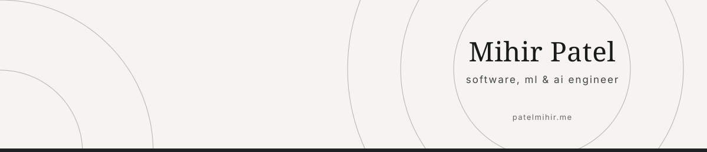

<!-- Header -->

  

---

### About Me

I'm **Mihir Patel**, a curious and enthusiastic **Undergrad** pursuing my B.E. in **Computer Engineering**, passionate about building intelligent systems that solve real-world problems.

- 🎓 Pursuing **B.E. in Computer Engineering**
- 🧠 Currently learning **DSA** and **Software Development**
- 💻 Passionate about **Web Development** & **Machine Learning**
- ✉️ Reach me at **[mihirpatel6075@gmail.com](mailto:mihirpatel6075@gmail.com)**

 

### Languages

  

---

### Libraries & Frameworks

  
  
  
  
  
  
  
  
  
  
  
  

---

### Tools

  

---

### Connect Me

  
  

